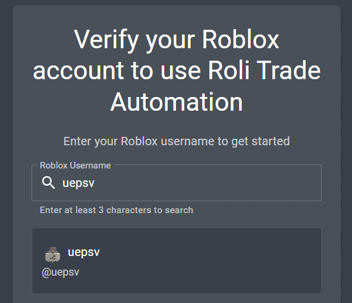
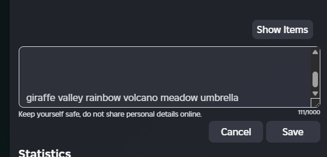
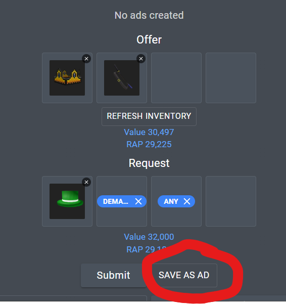
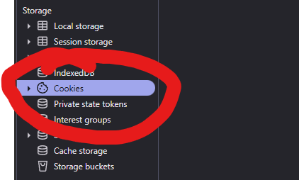
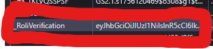
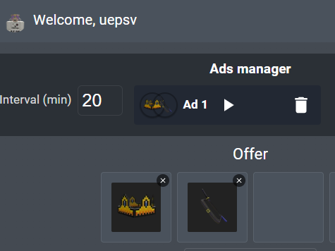

# How to use roli-trade-ad-automation

This quick guide walks through verifying your Roblox account and posting trade ads using the GUI. 

---

## 1. Verify your Roblox account

Before posting, verify your Roblox profile contains a generated verification code.

1. Enter and find your username.
2. Generate a verification code from the app.

- Go to your Roblox profile > About section and paste the generated verification code there.

- Wait a few moments for Roblox to save the description, then click "Verify" in the app.

---

## 2. Load your inventory

Once verified, the app will load your inventory and enrich each instance with catalog metadata.

Notes:
- Inventory is refreshed automatically every 20 minutes.
- Use the "Refresh Inventory" button to force a reload.

---

## 3. Build an ad (Offer & Request)

- Offer: select up to 4 items from your inventory.
- Request: select up to 4 catalog items or tags describing what you want.

Tips:
- Use the search box to find catalog items by name or abbreviation.
- Tags (e.g., ANY, DEMAND) count toward the 4-request limit.

---
## 3.5. Verify roli verification

When it is your first time posting an ad, you will be prompted to enter your roli verification cookie.

Go to <a href="https://rolimons.com" target="_blank" rel="noopener noreferrer">rolimons.com</a>, open your browser's developer tools (usually F12/inspect element), and find the value of the <code>roli_verification</code> cookie.

---
## 4. Save and run ads

- Click "Save as ad" to persist the current offer/request as a reusable ad.
- Open the Ads manager to view saved ads, set a global posting interval (minimum 15 minutes), and start/stop runners.

- Click the play button and it will run every interval you set, defaulted to 15 minutes.

Important:
- The app prevents intervals shorter than 15 minutes since the cooldown is 15.

---

## Return to main UI

Close this guide using the "Return to app" button or the dialog close control.

---

Thank you for using the app. If anything is unclear, open an issue in the forum.
